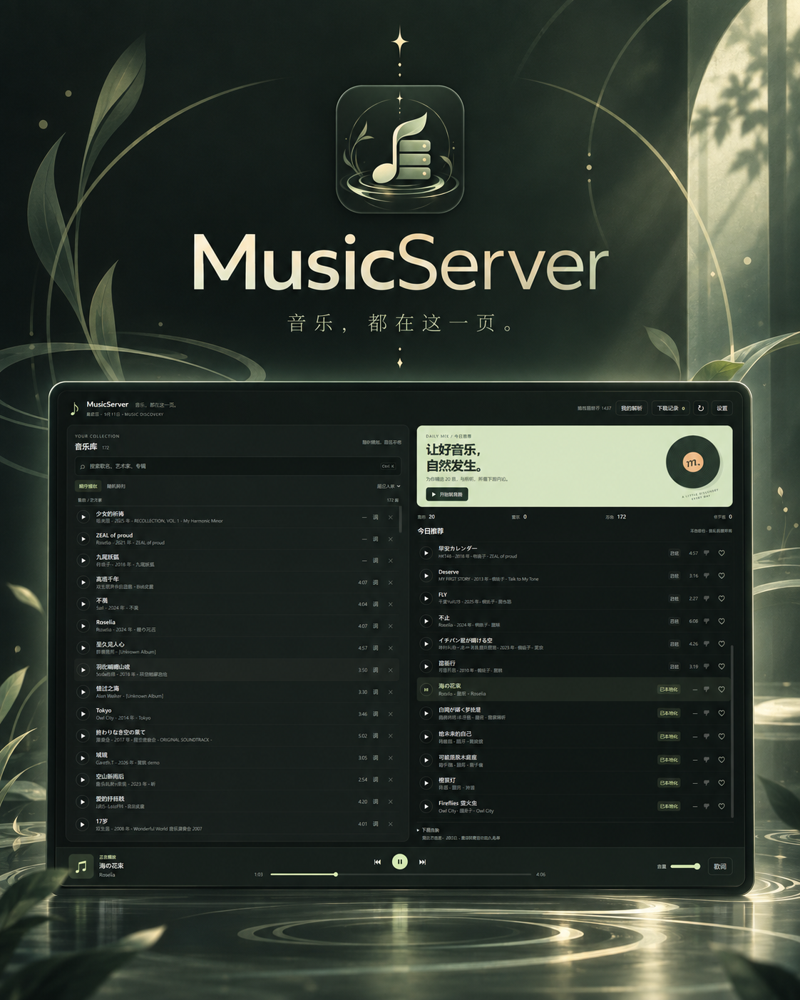

# MusicServer

<p align="center">
  
</p>

<p align="center">
  个人音乐服务器：本地音乐库 + 每日推荐 + Wanted 下载队列 + 歌词 + 播放统计<br />
  主客户端为 <b>Tauri v2 Windows 桌面 APP</b>
</p>

<p align="center">
  
</p>

## 当前架构

```text
Tauri APP / WebView2
        │
        ▼
127.0.0.1:8790  start_musicserver_ui.ps1
        │  静态 UI + /api/* 代理 + watchdog
        ▼
127.0.0.1:8787  music_api.ps1
        │
        ├─ SQLite 状态库（唯一运行时真源）
        ├─ APP_HOME 持久化状态
        ├─ MusicDir 独立音乐库
        ├─ Wanted worker
        └─ Navidrome / yt-dlp / ffmpeg 等本机集成
```

`web/` 是 Tauri WebView2 加载的共享 UI，不是另一套独立产品。桌面端代码位于 `src-tauri/`。

### 音乐树前端预览

APP 默认打开七首叶片音乐库与绿色水滴推荐。支持搜索、有歌词筛选、排序、滚轮逐首浏览、换组、拖动水滴定位，以及方向键 / Page Up / Page Down / Home / End。日推同时显示七首，点击非歌曲的水面会从点击位置扩散水波并换一批，与顶部推荐切换按钮共用逻辑；不足七首时显示已有曲目。播放、歌词、收藏、少推荐和下载动态沿用现有接口；切换浏览位置不会改变正在播放的歌曲。设置中可返回经典界面 `/index.html`。

预览入口为 `/music-tree.html`，矢量形状和交互在 `web/music-tree-ui.js` 与 `web/music-tree.css`，角色装饰为 `web/assets/muelsyse-water.png`（依据设计参考生成）。背景使用缓慢流动的折射水光；点击水面的三层波纹保持线宽，推荐延迟淡入淡出。页面遵循系统减少动态效果设置。最小化保留任务栏入口和常驻托盘，点击托盘可恢复窗口。此预览面向桌面窗口，建议 1280 × 820 或更大。

## Windows 桌面版

### 从源码构建

需要 Rust stable、Node/npm 与 Windows WebView2 构建环境：

```powershell
cd src-tauri
cargo fmt --check
cargo check --locked
npx --yes @tauri-apps/cli@2 build --bundles nsis
```

构建前 `scripts/prepare_tauri_runtime.ps1` 会自动生成 `src-tauri/resources/runtime/`，收集桌面 APP 真正需要的 PowerShell runtime（UI/API/worker/watchdog）、`web/` 和 `sqlite3.exe`。生成目录和 Rust `target/` 均不提交到 Git。

NSIS 安装包位于：

```text
src-tauri/target/release/bundle/nsis/*.exe
```

### 可移植运行时

发布版 **不再依赖 `CARGO_MANIFEST_DIR`、编译机源码路径或可执行文件所在 checkout**。安装后的 APP 从 bundle resources 读取 runtime，并同步到可写目录：

```text
%LOCALAPPDATA%\com.musicserver.desktop\
```

可通过环境变量 `MUSICSERVER_APP_HOME` 覆盖该位置。无论 APP 从安装目录、源码 checkout 还是临时目录启动，APP_HOME 都只由显式环境变量或 Windows 默认目录决定；repository 中是否存在 `Music/`、`DailyMix_data/`、`Navidrome/` 不会改变数据路径。

安装包内包含 SQLite，因此 UI/API 和状态库启动不要求用户另装 sqlite3。Bilibili 下载、转码和 Navidrome 集成仍分别需要 yt-dlp、ffmpeg/ffprobe、Navidrome；这些大型/外部组件不塞进桌面 runtime。
## 音乐库位置

安装版默认音乐库为：

```text
%LOCALAPPDATA%\com.musicserver.desktop\Music
```

用户可以在 APP 的“音乐库设置”中选择任意本地目录，例如 `D:\Music` 或 `E:\MyMusic`。配置持久化在 SQLite `app_settings` 中；`MUSICSERVER_MUSIC_DIR` 仅作为开发/高级用户 override，优先级高于 SQLite 设置。

更改音乐库位置**只改变 MusicServer 使用的目录，不会移动、复制或删除原有歌曲**。如果配置的是暂时离线的移动硬盘，MusicServer 会保留该设置并显示“不可用”，不会静默切回空的默认目录。恢复默认会重新使用 `<APP_HOME>\Music`。

歌词继续采用邻接文件约定：`Song.mp3` 与 `Song.lrc` 放在同一目录且 basename 相同。修改音乐库后需要重启 APP，让 UI/API/worker/Navidrome 全部使用新的目录。

## 数据与源码的边界

MusicServer 将三个概念严格分开：

```text
Repository = 源码、测试、文档和可重新生成的 build workspace
APP_HOME   = SQLite、DailyMix、Navidrome 数据、日志、备份和 secrets
MusicDir   = 用户可独立配置的音乐库
```

APP_HOME 下的默认持久化布局为：

```text
<APP_HOME>\
├─ DailyMix_data\state\musicserver.db
├─ Navidrome\Data\navidrome.db
├─ Navidrome\navidrome.toml
├─ logs\
├─ backups\
├─ output\
└─ secrets\cookies.txt
```

路径解析规则是：`MUSICSERVER_APP_HOME` -> `%LOCALAPPDATA%\com.musicserver.desktop`；`MusicDir` 则按 `MUSICSERVER_MUSIC_DIR` -> SQLite `app_settings.music_library_path` -> `<APP_HOME>\Music` 解析。`DailyDir` 始终是 `<MusicDir>\DailyMix`。配置音乐库路径不会移动、复制或删除歌曲；配置的目录暂时不存在时视为不可用。

源码 checkout 可以被 `git clean -fdx` 清空，也可以被删除后重新 clone。开发机若要使用已有持久化数据，请在启动前设置当前 PowerShell 会话：

```powershell
$env:MUSICSERVER_APP_HOME = 'E:\Project\MusicSever_app'
```

需要长期保存时可设置 User scope（不会修改 Machine scope）；新开的 PowerShell 才会自动继承：

```powershell
[Environment]::SetEnvironmentVariable('MUSICSERVER_APP_HOME', 'E:\Project\MusicSever_app', 'User')
```

如果需要把旧 checkout 中的 `DailyMix_data`、Navidrome 数据、日志、备份、Cookie 和歌词报告迁移到 APP_HOME，可使用安全迁移脚本。它要求 Navidrome 已停止、拒绝非空目标目录，并在逐项校验文件数量/大小/SHA-256 后才删除旧源文件；不会移动 repository `Music` 或外部音乐库：

```powershell
.\scripts\migrate_to_app_home.ps1 -AppHome $env:MUSICSERVER_APP_HOME
```

## 开发环境

项目仍以 Windows PowerShell 5.1 为正式脚本兼容基线。常用外部工具可从 PATH 找到，也可用环境变量覆盖：

```text
MUSICSERVER_SQLITE
MUSICSERVER_YTDLP
MUSICSERVER_FFMPEG
MUSICSERVER_FFPROBE
MUSICSERVER_APP_HOME
MUSICSERVER_NAVIDROME
```

含中文的 `.ps1` / `.psm1` 必须保持 UTF-8 BOM；仓库 `.editorconfig` 已固定这一规则。

## 核心目录

```text
MusicServer/
├─ .github/workflows/             # CI
├─ docs/                          # 当前说明 + 历史审计归档 + 品牌资产
│  └─ assets/                     # README 海报与仓库社交预览图
├─ scripts/                       # 构建/维护脚本
├─ src-tauri/                     # Tauri v2 Windows shell
│  ├─ src/main.rs                 # runtime 部署、服务生命周期、窗口导航
│  ├─ resources/runtime/          # 构建生成；Git 仅保留占位文件
│  ├─ icons/                      # Windows 构建所需图标
│  ├─ Cargo.toml / Cargo.lock
│  └─ tauri.conf.json
├─ web/                           # WebView2 UI
├─ tests/                         # Pester + 桌面 smoke
├─ MusicServer.Core.psm1
├─ MusicServer.Database.psm1
├─ MusicServer.Http.psm1
├─ MusicServer.State.psm1
├─ MusicServer.Providers.psm1
├─ music_api.ps1
├─ start_musicserver_ui.ps1
├─ watchdog_ui.ps1
└─ wanted_worker.ps1
```

历史架构审计和加固报告已移到 [`docs/archive/`](docs/archive/)。中文详细使用说明见 [`docs/USER_GUIDE.zh-CN.md`](docs/USER_GUIDE.zh-CN.md)。

品牌资产位于 [`docs/assets/`](docs/assets/)：`poster.png` 是 README 顶部的界面海报，`social-preview.png`（1280×640）用于 GitHub **Settings → Social preview** 上传。应用图标为 `src-tauri/icons/icon.ico` 与 `icon.png`；图标在原始方图基础上按 68% 取景重新裁切（保证 16/24/32 px 任务栏尺寸下音符可辨），并加圆角 alpha 蒙版导出为透明磁贴。

## 启动与日常操作

源码 checkout 中可直接：

```powershell
.\start_musicserver_ui.ps1
```

常用维护：

```powershell
# 推荐
.\daily_recommend.ps1 -DryRun
.\daily_recommend.ps1

# 清理
.\daily_cleanup.ps1 -DryRun

# 歌词
.\scripts\maintenance\fetch_lyrics.ps1 -DryRun
.\scripts\maintenance\fetch_lyrics.ps1 -Force

# 单曲歌词修复
.\scripts\maintenance\fix_one_lyric.ps1 -FilePattern "*歌曲名*" -Search "歌曲名"
```

安装版桌面 APP 会自动注册每日推荐计划任务（`MusicServer_DailyRecommend`，每天 07:00，动作绑定 APP_HOME），并在启动时补跑当天尚未生成的推荐；如需自定义时间或移除：

```powershell
.\register_daily_recommend.ps1 -Time 08:30
.\register_daily_recommend.ps1 -Unregister
```

## CI 与发布门禁

`.github/workflows/core-tests.yml` 在 `windows-latest` 上运行三个独立 gate：

| Job | 验证内容 |
|---|---|
| `state` | Core / Database / V2 / WorkerConcurrency / Recommendation / LegacyRetirement / Listening / Web / Tauri / ConfigurableLibrary / TestRunner / Identity Pester |
| `api` | Http / UiProxyRuntime / MediaRuntime / ApiTransaction / ApiRuntime Pester |
| `desktop-build` | `cargo fmt --check`、`cargo check --locked`、真实 NSIS 构建、安装包脱离源码 runtime 启动 smoke、artifact 上传 |

`desktop-build` 不只检查源码字符串：它会在干净 GitHub runner 上真正生成安装 EXE，然后静默安装到临时目录，临时禁用 checkout 中的 launcher/API/web，再启动已安装 APP。只有 bundle runtime 能自行部署、UI/API build marker 正常、SQLite 状态库建立且 APP 退出后所拥有的服务树全部停止，才算通过。

成功构建会上传名为：

```text
musicserver-windows-installer
```

的 GitHub Actions artifact。

## 运行规则

本地正式测试入口和套件索引见 [`tests/README.md`](tests/README.md)。`tests/run_suite.ps1` 固定使用 Pester 3.4.0，默认排除本机运行时测试，并记录具体失败详情与退出码。

- SQLite 是 MusicServer 唯一运行时状态真源；JSON 仅用于迁移输入、备份或兼容输出。
- 不要在 Navidrome 运行时直接写其 live DB。
- `artifacts/`、日志、音乐、cookies、本机数据库和生成的 Tauri runtime 都不应提交。
- `web/` 的 UI 改动必须以 Tauri APP 实际行为作为最终验收，不以浏览器单独可用作为桌面验收。
- 下载侧遇到 Bilibili 风控时遵守 Provider health/circuit-breaker 逻辑，不做无界重试。

## 性能基线与请求契约

优化进度见 [`docs/OPTIMIZATION_PLAN.zh-CN.md`](docs/OPTIMIZATION_PLAN.zh-CN.md)。可用 Windows PowerShell 5.1 运行隔离后端基线：

```powershell
powershell.exe -NoProfile -ExecutionPolicy Bypass -File scripts/measure_musicserver_backend.ps1
```

默认测量空库、1,000 和 10,000 条合成元数据，每个端点 30 个后续请求样本、5 次服务启动。测试元数据共用一段静音 WAV，不启动下载 worker；临时服务退出后清理测试库，JSON 报告和 CSV 样本保存在 `artifacts/performance/`。这衡量的是服务与元数据路径；Tauri 窗口、搜索渲染和不同真实音频文件的扫描成本需另行测量。

`MUSICSERVER_DIAGNOSTICS=1` 可让 API JSON 响应携带 `X-MusicServer-State-Sqlite-Calls`，表示该请求经状态库包装器启动的 sqlite3 进程数；它不包括 Navidrome 只读查询，默认关闭。

API 与 UI 代理的 JSON 控制请求最多 64 KiB，完整请求体须在 5 秒内到达。空请求体继续兼容；非空请求体必须是 UTF-8 JSON 对象。非法/不完整 JSON 返回 400，超时返回 408，chunked 请求返回 411，超限返回 413，不支持的压缩编码返回 415；连接已断开时可能无法返回错误正文。

## Runtime 构建标识与部署校验

桌面端、UI/API 和 smoke 使用 runtime 内容 SHA-256 标识，替代手写版本字符串。标识不包含机器路径或用户数据库；进程启动后保持不变。安装包的 schema 2 清单记录每个应用文件的大小与哈希，部署前检查完整性，再逐文件准备和替换。

此机制可在写入前发现包损坏，并避免单文件复制失败截断旧文件；尚不提供整组文件的原子升级、断电恢复或数据库版本回退。`MUSICSERVER_DISABLE_WORKER=1` 仅用于明确禁用下载 worker 的隔离启动测量，默认不设置。
